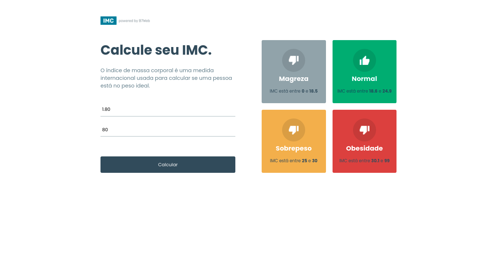

# 🇺🇸

# IMC Calculator 💪

Project in React + Typescript making a BMI (body mass index).

Project made through the course [B7Web](https://b7web.com.br)

# Installation & Running App:

- `npm install && npm run dev`

#

> Feel free to edit and make what you want 😊!

# 🇧🇷

# Calculadora de IMC

Projeto em React + Typescript fazendo um IMC (índice de massa corporal).

Projeto feito através do curso B7Web

## Instalação:

- `npm install`

## Para rodar:

- `npm run dev`

> Sinta-se livre para modificar e fazer o que você quiser 😊!
